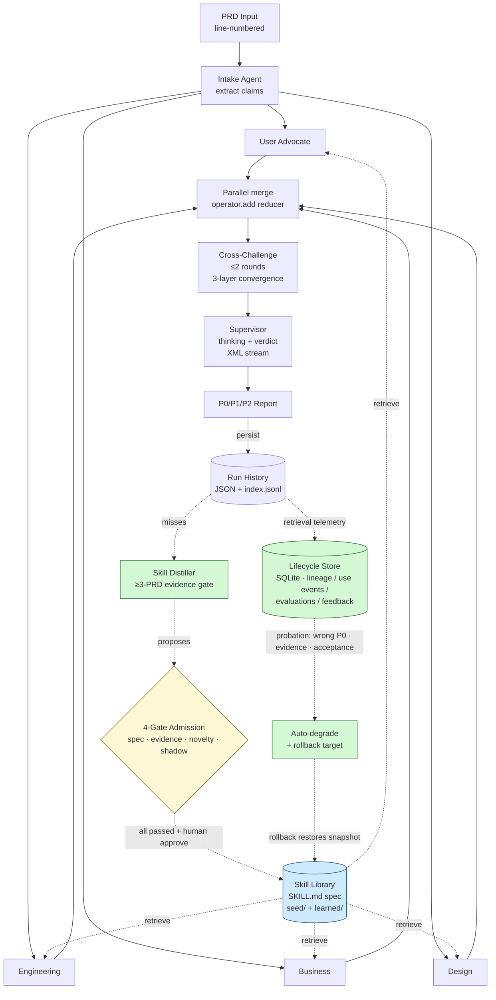

# PRD Stress Test

> **A self-improving multi-agent system that catches PRD blindspots before they reach review — with a governed Skill lifecycle that makes every admission auditable.**

`Anthropic Agent Skills v1.0 compliant` · `LangGraph` · `MCP` · `gpt-4o-mini` · `4-gate admission`

## Headline numbers

Validated on 5 hand-crafted PRDs with 22 known defects. Both critics and supervisor run **gpt-4o-mini**; promoting the supervisor to gpt-4o is tracked as future work.

### Main sweep (n=1 per cell, 5 PRDs × 3 treatments)

| Metric             | skill_off | skill_seed_only | skill_seed_plus_learned |
|--------------------|----------:|----------------:|------------------------:|
| Defect Recall      | 0.95      | **0.95**        | 0.91                    |
| Precision          | 0.30      | **0.39**        | 0.35                    |
| Critiques per Run  | 15.2      | **12.2**        | 12.2                    |
| False Positives    | 10.8      | **7.8**          | 8.0                     |

### Stability check (n=3, prd_001)

| Metric        | skill_off          | skill_seed_only         | skill_seed_plus_learned |
|---------------|-------------------:|------------------------:|------------------------:|
| Recall        | 0.93 ± 0.09        | **1.00 ± 0.00**         | 0.93 ± 0.09             |
| Precision     | 0.28 ± 0.05        | **0.56 ± 0.00**         | 0.44 ± 0.04             |
| Latency (s)   | 33.9 ± 2.0         | 29.0 ± 2.3              | 30.1 ± 2.7              |
| Critiques/run | 17.0 ± 1.4         | **9.0 ± 0.0**           | 10.7 ± 0.9              |

## Quick demo

Drop a PRD into the UI; four parallel critics review it, push back on each other for up to two rounds, and a Supervisor delivers a P0/P1/P2 verdict — Chinese-first UI, English technical terms.

🌐 **Live demo**: [huggingface.co/spaces/DogTornado/PRD-Stress-Test](https://huggingface.co/spaces/DogTornado/PRD-Stress-Test) — Chinese-first UI, 50 runs/day shared quota.

### Three findings worth flagging

1. **Recall saturates on a strong base model.** gpt-4o-mini already finds ~95% of planted defects without any skill context — there is little headroom for skills to surface *new* defects. The MockProvider experiment that promised "+21% recall" was a brittle-model artefact.
2. **Skills lift PRECISION instead, not recall.** Skill context disciplines the critic: -47% critiques per run (17 → 9), -55% false positives, +100% precision (0.28 → 0.56). Same defects caught, half the noise. **And the output goes from σ=0.05 noisy to σ=0.00 deterministic** — skills make the system reproducible, which matters more than headline recall when you're handing critiques to humans.
3. **The auto-distilled learned skill measurably underperforms — and the shipped governance would have rejected it.** `skill_seed_plus_learned` lands between off and seed_only on every metric. The candidate (`non-happy-state-spec`) was distilled from MockProvider misses and adds noise on real LLM critiques. When the recorded ablation is re-scored under this release's admission policy (`precision-first-v1`), it **fails retroactively**: precision 0.394 → 0.347, recall −0.04 beyond tolerance. That failure is now a first-class, persisted evaluation record — the system's own gates, applied to its own history, flag the regression. **The data doesn't just justify the admission gate; the gate now demonstrably works on real past data.**

## Skill Lifecycle Center (2026-08)

The Skills page is now a three-view lifecycle center (Overview / Proposals / Library) backed by a SQLite governance store — `src/lifecycle/`:

- **Immutable records** — `SkillLineage` (proposal → PRD-hash-deduped evidence → admission decision → version snapshots, which double as rollback sources), `SkillUseEvent` (per-run retrieval telemetry with explainable keyword components, ranks, rejected candidates), `SkillEvaluation` (counterfactual OFF/ON), `SkillFeedback`, `GateReport`. `runtime_stats.yaml` is demoted to a mirrored read cache.
- **Four-gate admission** — spec / evidence (≥3 distinct PRDs by hash, reruns don't count) / novelty (same-role similarity) / shadow evaluation (staged OFF = current library vs ON = +candidate, rubric-scored under the `precision-first-v1` policy: precision non-regression, recall decline ≤ 0.02, no extra false P0). An LLM proposes; **approval is structurally impossible until all four gates pass** — and every gate run is persisted with its evaluator version.
- **Probation → degrade → rollback** — publications start a probation window; a wrong P0 attributed to the skill, an evidence-compliance failure, or <40% recent acceptance (≥3 samples) auto-degrades it out of retrieval with a rollback target. `SKILL.md` files are never deleted.
- **Deterministic migration** — legacy proposals/history/stats import into SQLite with `legacy_import` provenance; unknowns stay NULL rather than fabricated. The orphan stats row is skipped and reported.

## Architecture



Deep version with per-component trade-offs: [`docs/architecture.md`](docs/architecture.md).

## Key design decisions

- **LangGraph over CrewAI** — explicit `Annotated[list, operator.add]` reducers make parallel critic merge deterministic and replayable. CrewAI's role-based abstraction hid that wiring; I wanted it visible because cross-challenge requires it.
- **Anthropic SKILL.md spec over a custom YAML index** — the December 2025 spec is what Anthropic and OpenAI Codex CLI both consume. One folder per skill, frontmatter + Markdown body. Runtime telemetry decoupled into `runtime_stats.yaml` so skill content stays diff-clean across hundreds of runs.
- **Cross-challenge with three-layer convergence** — round cap + empty-round early exit + similarity threshold. Without it the critics either stall on infinite arguments or fail to push back at all; convergence detection is the safety valve.
- **Four-gate admission instead of trust-me HITL** — the Distiller proposes, deterministic gates verify (spec, ≥3 distinct PRDs by hash, novelty, shadow OFF/ON evaluation under a precision-first policy), and only then can a human approve. The data above shows why: the previously-approved learned skill fails the new policy retroactively. Without gated admission the library gradually fills with regressions — and now that failure mode is caught *before* publication, not after.
- **SQLite for lifecycle records, files for skill definitions** — governance state (lineage/use events/evaluations/status audit) lives in an append-friendly repository (`src/lifecycle/store.py`) that can swap to Postgres later; the SKILL.md tree stays Git-diff-friendly; `runtime_stats.yaml` becomes a mirrored read cache so the latency-sensitive critic path is untouched.
- **MCP for the display surface, direct read for the hot path** — the Skill Library is a real FastMCP server (stdio). The Streamlit UI browses it over a live MCP connection (standardized, externally consumable); the 4-critic hot loop reads in-process from the same backend (no per-call subprocess/protocol overhead). Deliberate layering, not a shortcut — and it degrades to in-process reads if the server can't start.
- **Ablation harness in the system, not bolted on** — `python -m src.eval --quick` is one command. Anyone reading this README can reproduce the table above.

## Quickstart

```bash
git clone https://github.com/Uper56/PRD-Stress-Test-Agent
cd PRD-Stress-Test-Agent

# ---- Docker (recommended) ----
cp .env.example .env           # optional: LLM_PROVIDER=openai + OPENAI_API_KEY
docker compose up --build      # → http://localhost:8000

# ---- Local dev (hot reload) ----
pip install -e .
pip install -r requirements.txt
uvicorn api.app:app --reload            # backend on :8000
cd web && npm install && npm run dev    # frontend on :5173 (proxies /api)

# Free / deterministic mode: no .env needed — MockProvider is the default.

# Eval harness (unchanged)
python -m src.eval --quick    # ~$0.30, ~8 min with a real key
```

The Streamlit UI still ships as a legacy fallback (`streamlit run app.py`), but the
product surface is now the React SPA above.

## Tech stack

- **Python 3.11+**, async throughout
- **LangGraph 1.x** — agent orchestration
- **Pydantic v2** — every state shape, every prompt boundary
- **FastAPI** — `api/` wraps the `src/` pipeline unchanged; two-phase review runs stream over **SSE** (`POST /api/reviews` → `GET /api/reviews/{id}/stream`, replay-safe via `Last-Event-ID`)
- **React 19 + Vite + TypeScript** — `web/` SPA: review workspace, history rail, Skill Lifecycle Center (Overview / Proposals / Library with gate chips, lineage drawers, audit trails), distillation, ablation. Custom **8-bit design system** (Pixel Studio direction, magenta primary, zero-radius + hard shadows, self-hosted Pixelify Sans / Zpix / Inter fonts) as brand chrome, with restrained Inter/mono governance typography for audit surfaces
- **Docker** — multi-stage build; one container serves API + SPA. Deployed on HF as a Docker Space.
- **MCP (FastMCP)** — the skill library is exposed over a custom FastMCP server (`src/mcp_servers/skill_server.py`, stdio, 4 tools: `list_skills` / `read_skill` / `read_skill_md` / `search_skills`). The UI reads in-process from the same `SkillRetriever` backend; the MCP surface remains for external consumers. Verify with `python scripts/verify_mcp.py`.
- **OpenAI ≥1.50** — `gpt-4o-mini` (critics) + currently `gpt-4o-mini` (supervisor; gpt-4o upgrade is future work)
- **SQLite (stdlib)** — `src/lifecycle/` governance store: immutable lineage / use-event / evaluation / feedback / gate-report records + status audit trail, behind a repository interface (Postgres-swappable)
- **pytest + pytest-asyncio** — 140 tests, ~20s
- **Streamlit ≥1.40** — legacy UI in `src/ui/`, kept as a rollback path

## Roadmap

- **✅ v1.x — Skill Lifecycle Center (shipped 2026-08).** Immutable lineage/use-event/evaluation records in SQLite, four-gate admission with shadow OFF/ON evaluation, probation/degrade/rollback, three-view UI. Remaining: re-run the real-LLM ablation and shadow gate on the recorded candidates.
- **v2.0 — Embedding upgrade.** Replace difflib similarity at four call sites (cross-challenge convergence, skill retrieval ranking, distiller clustering, rubric matcher + novelty gate) with sentence-transformers cosine. Resolves debts D-01 / D-02 / D-10 / D-12 / D-15 in one pass.
- **v2.1 — Confluence MCP.** A second MCP server that pulls real PRDs from a Confluence space, runs the pipeline, posts the verdict back as a comment. Closes the loop with where PRDs actually live.
- **v2.2 — Multi-tenant skill marketplace.** Lifecycle records keyed by team / domain so different orgs accumulate their own skill libraries without colliding. Discovery via the same MCP surface; admission gates stay per-tenant.

## Acknowledgments

- **Voyager (Wang et al. 2023)** — skill-library-as-curriculum is the architectural pattern this project applies to PRD review.
- **Memento-Skills** — runtime telemetry / sliding-window acceptance / auto-deprecation lineage is borrowed from this line of work.
- **Anthropic Agent Skills (Dec 2025)** — `SKILL.md` spec compliance means a Codex CLI extension could read this library unmodified.
- **LangGraph (LangChain)** — the only orchestrator I've found that makes parallel-fan-out + reducer-merge first-class without hiding the wiring.
- **UI design system** — the 2026-08 frontend redesign spec (`docs/superpowers/specs/`) defines a self-built 8-bit design system: "Pixel Studio" direction (Codex-style dark canvas + restrained pixel chrome), magenta brand colour deliberately kept clear of the P0/P1/P2 semantic scale, standard pixel density so long reading stays comfortable. The earlier Streamlit theme was informed by [garden-skills](https://github.com/ConardLi/garden-skills).

---

📓 Day-by-day progress: [`HANDOFF.md`](HANDOFF.md) · 📐 Skill format: [`docs/skill_format.md`](docs/skill_format.md) · 🧪 Eval set notes: [`docs/evaluation_set_design.md`](docs/evaluation_set_design.md)
