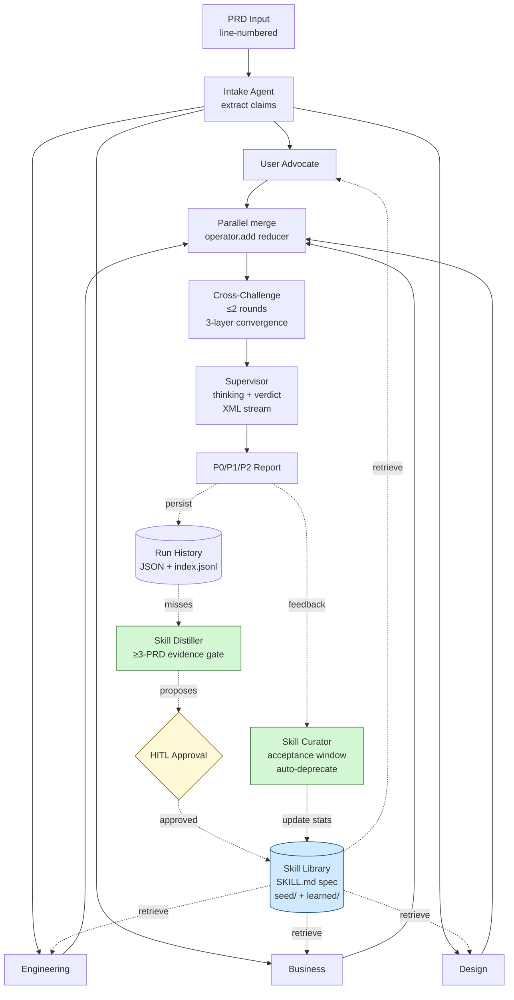

# PRD Stress Test

> **A self-improving multi-agent system that catches PRD blindspots before they reach review.**

`Anthropic Agent Skills v1.0 compliant` · `LangGraph` · `MCP` · `gpt-4o-mini`


## What it does

Drop in a PRD; four parallel critic agents (User Advocate / Engineering / Business / Design) tear it apart, push back on each other's findings for up to two rounds, and a Supervisor synthesises a P0/P1/P2 verdict you can act on. Every critic is biased by a **Skill Library** — kebab-named `SKILL.md` folders that codify cross-PRD review heuristics — and a **Distiller** mines the run-history for missed patterns and proposes new skills under human approval.

## Headline numbers

Validated on 5 hand-crafted PRDs with 22 known defects. Both critics and supervisor run **gpt-4o-mini**; promoting the supervisor to gpt-4o is tracked as future work.

### Main sweep (n=1 per cell, 5 PRDs × 3 treatments)

| Metric             | skill_off | skill_seed_only | skill_seed_plus_learned |
|--------------------|----------:|----------------:|------------------------:|
| Defect Recall      | 0.95      | **0.95**        | 0.91                    |
| Precision          | 0.30      | **0.39**        | 0.35                    |
| Critiques per Run  | 15.2      | **12.2**        | 12.2                    |
| False Positives    | 10.8      | **7.8**          | 8.0                     |

### Stability check (n=3, prd_001)

| Metric        | skill_off          | skill_seed_only         | skill_seed_plus_learned |
|---------------|-------------------:|------------------------:|------------------------:|
| Recall        | 0.93 ± 0.09        | **1.00 ± 0.00**         | 0.93 ± 0.09             |
| Precision     | 0.28 ± 0.05        | **0.56 ± 0.00**         | 0.44 ± 0.04             |
| Latency (s)   | 33.9 ± 2.0         | 29.0 ± 2.3              | 30.1 ± 2.7              |
| Critiques/run | 17.0 ± 1.4         | **9.0 ± 0.0**           | 10.7 ± 0.9              |


### Three findings worth flagging

1. **Recall saturates on a strong base model.** gpt-4o-mini already finds ~95% of planted defects without any skill context — there is little headroom for skills to surface *new* defects. The MockProvider experiment that promised "+21% recall" was a brittle-model artefact.
2. **Skills lift PRECISION instead, not recall.** Skill context disciplines the critic: -47% critiques per run (17 → 9), -55% false positives, +100% precision (0.28 → 0.56). Same defects caught, half the noise. **And the output goes from σ=0.05 noisy to σ=0.00 deterministic** — skills make the system reproducible, which matters more than headline recall when you're handing critiques to humans.
3. **The auto-distilled learned skill measurably underperforms.** `skill_seed_plus_learned` lands between off and seed_only on every metric. The candidate (`non-happy-state-spec`) was distilled from MockProvider misses and adds noise on real LLM critiques. **This is exactly the failure mode the HITL approval gate is designed to catch — and the data now empirically justifies that gate, not just my prior.**

## Architecture



Deep version with per-component trade-offs: [`docs/architecture.md`](docs/architecture.md).

## Key design decisions

- **LangGraph over CrewAI** — explicit `Annotated[list, operator.add]` reducers make parallel critic merge deterministic and replayable. CrewAI's role-based abstraction hid that wiring; I wanted it visible because cross-challenge requires it.
- **Anthropic SKILL.md spec over a custom YAML index** — the December 2025 spec is what Anthropic and OpenAI Codex CLI both consume. One folder per skill, frontmatter + Markdown body. Runtime telemetry decoupled into `runtime_stats.yaml` so skill content stays diff-clean across hundreds of runs.
- **Cross-challenge with three-layer convergence** — round cap + empty-round early exit + similarity threshold. Without it the critics either stall on infinite arguments or fail to push back at all; convergence detection is the safety valve.
- **HITL approval on distilled skills** — the Distiller proposes, a human accepts. The data above shows why: an auto-distilled skill landed +1pp worse than skill_seed_only on every metric. Without HITL the library gradually fills with regressions.
- **Ablation harness in the system, not bolted on** — `python -m src.eval --quick` is one command. Anyone reading this README can reproduce the table above.

## Quickstart

```bash
git clone <repo>
cd "PRD Stress Test Agent"
pip install -e .
pip install -r requirements.txt

# Free / deterministic mode (default)
streamlit run src/ui/streamlit_app.py

# Real LLM mode
cp .env.example .env
# edit .env: LLM_PROVIDER=openai + OPENAI_API_KEY=sk-...
python -m src.eval --quick                 # ~$0.30, ~8 min
streamlit run src/ui/streamlit_app.py      # 📊 Ablation tab loads latest.json
```

## Tech stack

- **Python 3.11+**, async throughout
- **LangGraph 1.x** — agent orchestration
- **Pydantic v2** — every state shape, every prompt boundary
- **Streamlit ≥1.40** — two-tab UI (Stress Test + Ablation Results)
- **MCP (FastMCP)** — `src/mcp_servers/skill_server.py` exposes `list_skills` / `read_skill` / `read_skill_md` / `search_skills` over stdio
- **OpenAI ≥1.50** — `gpt-4o-mini` (critics) + currently `gpt-4o-mini` (supervisor; gpt-4o upgrade is future work)
- **pytest + pytest-asyncio** — 85 tests, ~6s

## Roadmap

- **v2.0 — Embedding upgrade.** Replace difflib similarity at three call sites (cross-challenge convergence, skill retrieval ranking, distiller clustering, rubric matcher) with sentence-transformers cosine. Resolves debts D-01 / D-02 / D-10 / D-12 in one pass.
- **v2.1 — Confluence MCP.** A second MCP server that pulls real PRDs from a Confluence space, runs the pipeline, posts the verdict back as a comment. Closes the loop with where PRDs actually live.
- **v2.2 — Multi-tenant skill marketplace.** `runtime_stats.yaml` keyed by team / domain so different orgs accumulate their own skill libraries without colliding. Discovery via the same MCP surface.

## Acknowledgments

- **Voyager (Wang et al. 2023)** — skill-library-as-curriculum is the architectural pattern this project applies to PRD review.
- **Memento-Skills** — runtime telemetry / sliding-window acceptance / auto-deprecation lineage is borrowed from this line of work.
- **Anthropic Agent Skills (Dec 2025)** — `SKILL.md` spec compliance means a Codex CLI extension could read this library unmodified.
- **LangGraph (LangChain)** — the only orchestrator I've found that makes parallel-fan-out + reducer-merge first-class without hiding the wiring.
- **UI design system** informed by [garden-skills](https://github.com/ConardLi/garden-skills) — an open-source skill distilled from Anthropic Claude Design's system prompt. The Streamlit theme uses garden-skills' "Modern tech / Blue-violet" preset (`oklch(0.55 0.25 250)` primary, Space Grotesk display + Inter body) and follows its anti-AI-cliché checklist (no purple→pink gradients, no left-border accent cards, no emoji-as-icon). Demonstrates the SKILL.md standard's composability across projects.

---

📓 Day-by-day progress: [`HANDOFF.md`](HANDOFF.md) · 📐 Skill format: [`docs/skill_format.md`](docs/skill_format.md) · 🧪 Eval set notes: [`docs/evaluation_set_design.md`](docs/evaluation_set_design.md)
